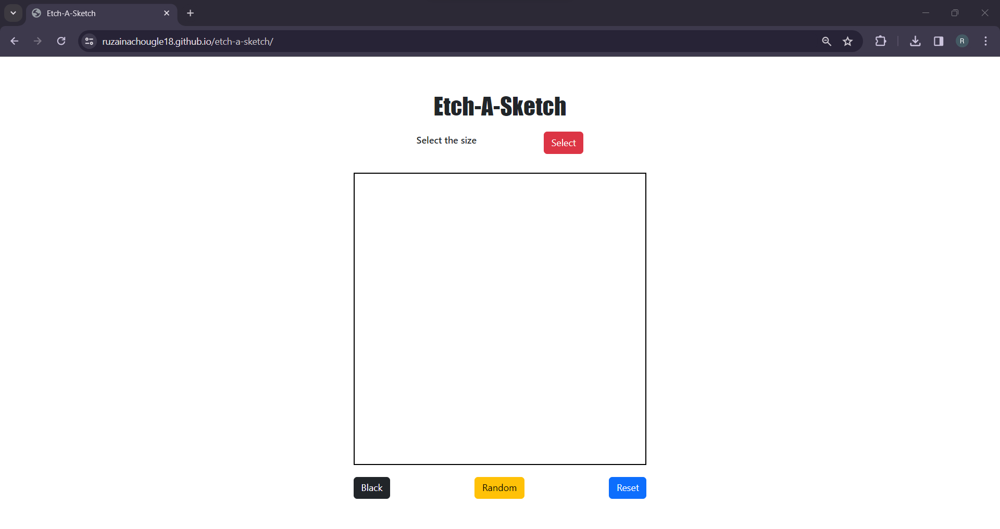

 # etch-a-sketch
This Etch-A-Sketch game is created with HTML, CSS &amp; JavaScript. This game was made for assignment in the foundation course of The Odin Project.

<a href="https://ruzainachougle18.github.io/etch-a-sketch/" target="_blank">Live Link</a>

### Technologies used: 
* JavaScript
* HTML
* CSS
* Bootstrap

### Tools:
* Visual Studio Code
* Git
* GitHub
